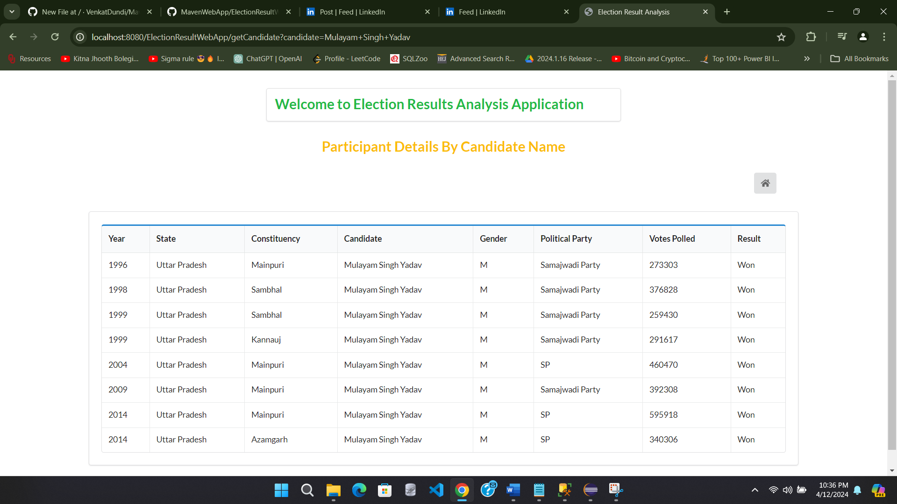

This project focuses on developing a maven web application using MVC architecture, Java Server Pages, and Java Database Connectivity to SQL Server. 

This Web application helps in interacting with the Election Result Database - Used in the SQL Project, and retrieving results from it for 4 database queries which can be executed using UI buttons, by providing user input fields provided on respective web pages. 

SQL Project - (https://github.com/VenkatDundi/SQL-Projects/tree/main/Election_Result_Analysis)

The result set of queries will be retrieved and displayed on the result pages for each query.

[Flow Diagram of Application](README.md#flow-diagram)  
[Requirements of Application](README.md#requirements)  
[Maven Usage in Application](README.md#maven-usage)  
[MVC Architecture Usage](README.md#mvc-usage)  
[Takeaways from the Project](README.md#takeaway)  
[Improvements to be made in application](README.md#improvements-required)  
[ScreenShots of the Queries executed](README.md#snapshots)  

### Flow Diagram:

### Requirements:
> Maven  
> MVC Architecture  
> Java Servlets  
> Java Server Pages  
> Java Database Connectivity  
> Database    
> Basic User Interface - HTML and CSS  
> Apache TomCat Server Configuration with Eclipse (Any IDE)

### Maven Usage:

Maven helps in organizing and acquiring all the dependencies required during the development of an application. For example, we need certain .jar package files for implementing JDBC connectivity to specific databases. 
Instead of downloading them separately and maintaining the folder structure in the project, Maven helps us in doing this job. 

1. Create a new Maven Project in Eclipse
2. Select the Archetype for application - An archetype that contains a sample Maven Webapp project
3. Configure the Project Object Model (pom.xml) file which helps in acquiring the dependencies - Search for dependencies in the Maven Repository available online and copy the dependencies to pom.xml
4. Configure the Tom Cat Server [Server Run Time] for running the application on the local host

### MVC Usage:

This architecture [Model - View - Controller] helps in maintaining the components of a web application separately so that the application can be easily developed and changes can be made to individual modules simultaneously.

#### Model: This component helps in working with the data prototype or structure of the database - Uses Java Class & Methods

In our project, an Election class has been defined with all the attributes required for performing operations on the database using the queries. They help in performing the below tasks. 

> Define required variables and their respective data types based on the return type of functions  
> Define getter and setter methods that help to retrieve the data from certain objects  
> Define User-defined methods that help in returning the data for a specific query  

#### View: This component helps in viewing the data records on the web page - Uses Java Server Pages, HTML formatting

In our project, Java Server Pages have been used to display the content on the web pages. They are helpful in 2 aspects.   
> Collect the user input through the text fields from the web page  
> Display the result set returned by the query on the web page  

#### Controller: This component helps in the transfer of data in the form of requests and responses among web pages - Uses Servlets 

In our project, the Java Servlet classes are used to achieve this functionality. They help in performing the below tasks.  
> Collect the parameters from web pages and use them as variables  
> Create an object for class and call methods that perform the execution of queries on the database  
> Collect the result set received from the method in a variable  
> Forward the request and corresponding response to the destination page (View component) that displays the content  

#### DAO Class: This component helps in specifying the interactions with the database in a separate class - Uses the Java class

In our project, we defined an interface that can serve as a template for specifying the methods required to implement the queries on the database.
> Interface just specifies the class methods with required parameters and return types

DAO class Implements this interface to provide the functionality of each method declared in the interface. It helps in performing the below tasks 

> Specify JDBC connectivity steps to initiate a connection to the database  
> Create a statement to execute the query using the parameters specified for the method  
> Initialize the resultset of the query to the respective variable and process it using the getter & setter methods  
> In the case of Stored Procedures, it needs to be executed before the actual query in a specific class method

#### Web.xml: This component helps in mapping the servlet request with the respective controller

In our project, 4 servlet mappings have been defined, with each request mapping to the specific controller

### Takeaway:

> Connection string using Windows authentication to connect to the database  
> Managing dependencies in pom.xml  
> Servlet dependencies - Jakarta vs javax  
> In the DAO class, set parameters to be specified in the same order as we consider in the stored procedure.

### Improvements Required:

> Better User Interface - Provide drop-down lists on web pages  
> Separate method for executing all the stored procedures at once rather than having a procedure for each query functionality  
> Need to improve the design of the Model class  
> More queries can be implemented to show statistics in detail as shown in SQL Project - Election Result Analysis    

### Snapshots:

  

  

  

[View More ScreenShots](https://github.com/VenkatDundi/MavenWebApp/new/main?filename=README.md#snapshots)
